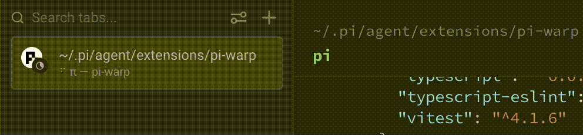

# pi-warp

Real-time [pi](https://github.com/earendil-works/pi-coding-agent) notifications in the [Warp](https://www.warp.dev/) terminal.

pi-warp surfaces pi agent activity inline in Warp — so you always know what the agent is doing without switching context.



## Features

- **Session tracking** — Warp knows when pi starts and stops a session.
- **Prompt notifications** — see when your prompt has been submitted and the agent begins working.
- **Tool result alerts** — get notified each time a tool finishes executing.
- **Completion signal** — Warp tells you when the agent has finished its work.
- **Animated terminal title** — an optional braille spinner in your terminal title while the agent is busy.

## Requirements

- **[Warp](https://www.warp.dev/)** — build newer than `v0.2026.03.25.08.24.stable_05` (stable) or `v0.2026.03.25.08.24.preview_05` (preview). Dev channel builds are always supported.
- **[pi](https://github.com/earendil-works/pi-coding-agent)** coding agent.
- **Node.js** ≥ 20.

> pi-warp detects Warp automatically. If you're running an incompatible build or not inside Warp, the extension silently disables itself — nothing breaks.

## Installation

```bash
pi install npm:pi-warp
```

Or manually: clone this repository into your pi extensions directory (`~/.pi/agent/extensions/`).

## Usage

No configuration needed — notifications start automatically when you launch pi inside Warp.

You'll see inline Warp notifications as the agent:

1. **Starts a session** — confirms the extension is active.
2. **Receives your prompt** — shows the agent is working.
3. **Completes a tool call** — one notification per tool execution.
4. **Finishes its work** — lets you know the agent is done.

### Settings

Run the following command inside pi to open the settings panel:

```
/pi-warp-settings
```

| Setting | Default | Description |
|---|---|---|
| **Dynamic Terminal Titles** | on | Animate the terminal title with a braille spinner while the agent is working |

<details>
<summary>Editing settings directly</summary>

Settings are stored in pi's global config at `~/.pi/agent/settings.json` under the `piWarp` key:

```json
{
  "piWarp": {
    "dynamicTitles": false
  }
}
```

</details>

## Troubleshooting

**I don't see any notifications**

- Make sure you're running pi **inside Warp** (not another terminal emulator).
- Check your Warp version meets the minimum listed in [Requirements](#requirements).
- pi-warp prints a message on session start if Warp was not detected — look for it in your pi log.

**Notifications stopped after a Warp update**

- Warp may have changed its environment variables. Open a new terminal window and try again.
- If the issue persists, [file an issue](../../issues).

**The spinner in the terminal title is distracting**

- Run `/pi-warp-settings` in pi and set **Dynamic Terminal Titles** to `off`.

## License

MIT
